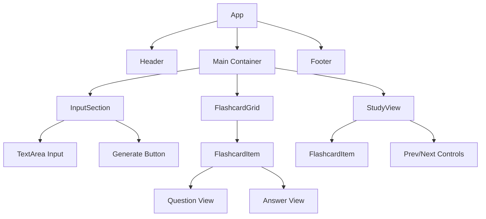

# QuizGenius Specification

## 1. Overview
QuizGenius is a SaaS application that leverages AI to transform raw text into structured flashcard decks. Users can paste study materials, and the system automatically generates question-answer pairs for efficient learning.

## 2. Tech Stack
- **Frontend**: React (Vite)
- **Styling**: TailwindCSS
- **Backend/Database**: Supabase
- **AI Engine**: Google Gemini API (via Vertex AI or Gemini Pro)

---

## 3. Database Schema (Supabase)

The database consists of two primary tables: `decks` and `flashcards`.

### `decks` Table
Stores metadata for a collection of flashcards.

| Column | Type | Constraints | Description |
| :--- | :--- | :--- | :--- |
| `id` | `uuid` | `primary key, default: gen_random_uuid()` | Unique identifier for the deck. |
| `created_at` | `timestamp` | `default: now()` | Creation timestamp. |
| `user_id` | `uuid` | `foreign key (auth.users.id)` | Owner of the deck. |
| `title` | `text` | `not null` | Title of the flashcard deck. |
| `description` | `text` | `nullable` | Optional summary of the content. |

### `flashcards` Table
Stores individual flashcard items linked to a deck.

| Column | Type | Constraints | Description |
| :--- | :--- | :--- | :--- |
| `id` | `uuid` | `primary key, default: gen_random_uuid()` | Unique identifier for the card. |
| `deck_id` | `uuid` | `foreign key (decks.id), on delete cascade` | Links card to a specific deck. |
| `question` | `text` | `not null` | The study question. |
| `answer` | `text` | `not null` | The correct answer/explanation. |
| `difficulty` | `text` | `not null` | Difficulty level (Easy, Medium, Hard). |
| `created_at` | `timestamp` | `default: now()` | Creation timestamp. |

---

## 4. AI Generation JSON Interface

To ensure the Gemini API returns data in a predictable format, the prompt must enforce the following strict JSON schema.

### JSON Schema
```json
{
  "type": "object",
  "properties": {
    "title": { "type": "string" },
    "description": { "type": "string" },
    "flashcards": {
      "type": "array",
      "items": {
        "type": "object",
        "properties": {
          "question": { "type": "string" },
          "answer": { "type": "string" },
          "difficulty": { "type": "string", "enum": ["Easy", "Medium", "Hard"] }
        },
        "required": ["question", "answer", "difficulty"]
      }
    }
  },
  "required": ["title", "flashcards"]
}
```

### Prompt Strategy
The system message should instruct the AI:
> "Analyze the provided text and generate a structured JSON object containing a title for the deck and an array of flashcards. Each flashcard must have a 'question', an 'answer', and a 'difficulty' rating (Easy, Medium, or Hard) based on the complexity of the concept. Return only the JSON."

---

## 5. Component Hierarchy

The application will follow a modular component structure:



### Component Responsibilities:
- **App**: Manages global state (user auth, current deck, active view).
- **InputSection**: Handles user text input and triggers the AI generation process.
- **FlashcardGrid**: An interactive grid that maps through the generated or fetched cards.
- **StudyView**: A focused mode that displays one card at a time with navigation controls.
- **FlashcardItem**: Individual card component with "flip" animation logic for revealing answers.

---

## 6. Data Flow

1. **Input**: User pastes text into `InputSection`.
2. **Generation**: `InputSection` sends text to a serverless function (or direct client call if secure) which prompts Gemini API.
3. **Parsing**: JSON response is parsed and displayed in `FlashcardGrid`.
4. **Persistence**: User clicks "Save", creating a record in `decks` and bulk-inserting items into `flashcards`.
